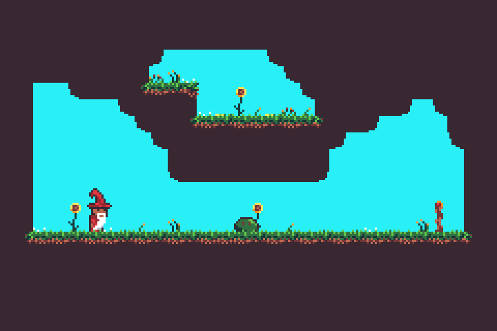
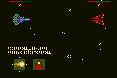

# Tiled backgrounds

Tiled backgrounds are used to show the backdrop of games, along with any other mostly-static content such as heads-up-displays (HUDs) or menus.
They are used in almost every commercial GBA game.
In a tiled background, the background is made of individual 8x8 tiles which can be repeated as many times as needed.

The reason you'd need to use a tiled background is because of how much RAM and CPU time it takes to display a GBA-screen sized background.
They also allow for easy scrolling, and with reused tiles you can update large amounts of the screen very efficiently.



In the example above, you can see repeated tiles used for the brown background along with the flowers, grass and ground.
The only part of the above example that isn't a background is the wizard on the left and the slime in the centre.

The following sections build up an example showing a simple scene.
If you want to follow along, you can download `beach-background.aseprite` from [here](https://github.com/agbrs/agb/blob/master/agb/examples/gfx/beach-background.aseprite).
Copy this into a `gfx` folder in the same directory as the `src` directory for your project.

## Tile set importing

In order to display tiles on the screen, we'll first need to import it into the game.
A collection of imported tiles is referred to as a [`TileSet`](https://docs.rs/agb/latest/agb/display/tiled/struct.TileSet.html).
You wouldn't normally create a `TileSet` manually, and instead have it created using the [`include_background_gfx!`](https://docs.rs/agb/latest/agb/macro.include_background_gfx.html) macro.

`agb` natively supports importing `aseprite`, `png` or `bmp` files for backgrounds.
The syntax is as follows:

```rust
use agb::include_background_gfx;

include_background_gfx!(
    mod background,
    BEACH => deduplicate "gfx/beach-background.aseprite"
);
```

This creates a `background` module which contains a tileset named `BEACH`.
The `deduplicate` parameter means that `agb` will take tiles with the same content and merge them into the same tile.
This saves space in the final ROM, and saves video RAM during runtime, since duplicate tiles will only appear once.

## Palette setup

Although the Game Boy Advance can display 32,768 colours, the background tiles are stored in either 4 bits per pixel (16 colours) or 8 bits per pixel (256 colours).
You will need to tell the video hardware what colour to use for each of the pixels in the `TileSet`.

This is stored in the palette, which is also included in the module created by `include_background_gfx!`.
To set the palettes available for backgrounds, use the [`set_background_palettes`](https://docs.rs/agb/latest/agb/display/tiled/struct.VRamManager.html#method.set_background_palettes) method on the `VRAM_MANAGER` instance.

```rust
use agb::{
    display::tiled::VRAM_MANAGER,
    include_background_gfx,
};

include_background_gfx!(
    mod background,
    BEACH => deduplicate "gfx/beach-background.aseprite"
);

#[agb::entry]
fn main() -> ! {
    VRAM_MANAGER.set_background_palettes(background::PALETTES);

    loop {}
}
```

## `RegularBackgroundTiles`

With a `TileSet` ready and a palette set up, we need to actually declare which tiles to show where on the screen.
This is done using the [`RegularBackgroundTiles`](https://docs.rs/agb/latest/agb/display/tiled/struct.RegularBackgroundTiles.html) struct.
The `RegularBackgroundTiles` reserves some video RAM to store which tile goes where and other metadata about it like it's palette number and whether it should be flipped.

[`RegularBackgroundTiles::new`](https://docs.rs/agb/latest/agb/display/tiled/struct.RegularBackgroundTiles.html#method.new) takes 3 arguments.
The `priority` (which we'll set to `Priority::P0` for now), a tile format which you can get from `background::BEACH.format()` and a `size`.

The size of the background can be one of [4 values](https://docs.rs/agb/latest/agb/display/tiled/enum.RegularBackgroundSize.html).
The Game Boy Advance has a screen size of 240x160 pixels which is equal to 30x20 tiles, and the smallest background is 32x32 tiles.
Backgrounds can be scrolled around, and will wrap around the screen if the edge of the background is out of view.
The bigger the background, the more video RAM will get used by both the tiles within it (since each tile in a background must be stored in vram, even if it isn't currently visible on the screen) and also more video RAM is needed to store the actual list of tile indices.
In most cases, `Background32x32` is the best choice since you can cover the entire screen and it uses very little video RAM.


However, there are also cases where other sizes are a good choice.
The example to the right uses a `64x32` background to implement the parallax background.

For this example, we'll just create a 32x32 background, but it is important to always consider the background size when creating one in your game.

```rust
use agb::{
    display::Priority,
    display::tiled::{
        RegularBackgroundTiles, RegularBackgroundSize,
        VRAM_MANAGER,
    },
    include_background_gfx,
};

include_background_gfx!(
    mod background,
    BEACH => deduplicate "gfx/beach-background.aseprite"
);

#[agb::entry]
fn main() -> ! {
    VRAM_MANAGER.set_background_palettes(background::PALETTES);

    // Create the background tiles ready for us to display on the screen
    let mut tiles = RegularBackgroundTiles::new(
        Priority::P0,
        RegularBackgroundSize::Background32x32,
        background::BEACH.tiles.format()
    );

    loop {}
}
```

You'll now want to put tiles onto the background, ready to display them.
This is done using the [`set_tile()`](https://docs.rs/agb/latest/agb/display/tiled/struct.RegularBackgroundTiles.html#method.set_tile) method.
Let's loop over the width and height of the Game Boy Advance screen and set the tile in the background, so after the tiles are created, something like:

```rust
for y in 0..20 {
    for x in 0..30 {
        let tile_index = y * 30 + x;

        tiles.set_tile(
            (x, y),
            &background::BEACH.tiles,
            background::BEACH.tiles.tile_settings[tile_index],
        );
    }
}
```

Note that if you run this, you still won't get anything showing on screen until you show the background on the frame, which we'll do in the next section.

## Showing a background on the screen

To show a background on the screen, you'll need to to call the [`.show()`](https://docs.rs/agb/latest/agb/display/tiled/struct.RegularBackgroundTiles.html#method.show) method passing in the current [`GraphicsFrame`](https://docs.rs/agb/latest/agb/display/GraphicsFrame.html).

See the [`frame lifecycle`](./frame_lifecycle.md) article for more information about frame lifecycles, but to show our example so far, replace the loop with the following

```rust
let mut gfx = gba.graphics.get();

loop {
    let mut frame = gfx.frame();
    background.show(&mut frame);
    frame.commit();
}
```

## Background scrolling

One of the key things you can use backgrounds to do is to display something scrolling.
You can use this to make your level bigger than the world map, or to do some parallax effect in the background.

You can scroll the background with the [`.set_scroll_pos()`](https://docs.rs/agb/latest/agb/display/tiled/struct.RegularBackgroundTiles.html#method.set_scroll_pos) method.
The `scroll_pos` passed to the `.set_scroll_pos()` method is effectively the 'camera' position.
It chooses where the top left camera position should be.
So increasing the `x` coordinate will slide the background to the right, to ensure that the top-left corner of the Game Boy Advance's screen is at that pixel.

Backgrounds will wrap around if they are pushed off the edge of the screen.
See the [scrolling example](https://agbrs.dev/examples/scrolling_background) for an example of using the scroll position.

## Multiple backgrounds and priorities

The Game Boy Advance has the ability to show up to 4 background concurrently.
These can be layered on top of eachother to create different effects like the parallax effect above or to always show certain things above the rest of the game.

### Displaying multiple backgrounds

You can display multiple backgrounds at once by calling the [`.show()`](https://docs.rs/agb/latest/agb/display/tiled/struct.RegularBackgroundTiles.html#method.show) method on each background passing the same [`frame`](https://docs.rs/agb/latest/agb/display/GraphicsFrame.html) instance.
If you try to show more than 4 backgrounds, then the call to `.show()` will panic.

### Transparency

When two backgrounds are rendered on top of eachother, the lower background will be visible through the transparent pixels in the backgrounds above.
Only full transparency is supported, partial transparency is ignored.

Any pixels with no background visible at all will be displayed in the first colour in the first palette.
You can alter what colour this is in the [`include_background_gfx!`](https://docs.rs/agb/latest/agb/macro.include_background_gfx.html) call.

```rust
use agb::{
    display::tiled::VRAM_MANAGER,
    include_background_gfx,
};

include_background_gfx!(
    mod background,
    "00bdfe", // the hex code of the sky colour we want to use as the background layer
    BEACH => deduplicate "gfx/beach-background.aseprite"
);

#[agb::entry]
fn main() -> ! {
    // by setting the background colour here, the first colour will be the sky colour,
    // so rather than filling the screen with black you will now instead have it
    // filled with blue. Even though we don't show anything yet.
    VRAM_MANAGER.set_background_palettes(background::PALETTES);

    loop {}
}
```

There is also a special tile setting you can use in the call to [`set_tile()`](https://docs.rs/agb/latest/agb/display/tiled/struct.RegularBackgroundTiles.html#method.set_tile), [`TileSetting::BLANK`](https://docs.rs/agb/latest/agb/display/tiled/struct.TileSetting.html#associatedconstant.BLANK).
This is a fully transparent tile, and if you ever want a tile in your background to be fully transparent, it is better to use this one for performance.

### Priority and interaction with objects

There are 2 things which impact which background gets displayed above other ones.
The [priority](https://docs.rs/agb/latest/agb/display/enum.Priority.html), and the order in which you call `.show()`.
Backgrounds with higher priorities are rendered first, and so are rendered behind those with lower priorities.
Between backgrounds with the same priority, the one which called `.show()` first will render before (and therefore behind) the later ones.

When interacting with objects, objects with the same priority as backgrounds are always displayed _above_ the background.
You can use this to display the [Heads Up Display (HUD)](<https://en.wikipedia.org/wiki/HUD_(video_games)>) above the player by putting the HUD background on priority 0, the main background on priority 3 and the player also on priority 3.

See the [hud example](https://agbrs.dev/examples/hud) for an example of how to use priorities to draw a heads up display above the scene we've been working on.

- Infinite maps

  - Why you would need them
  - Worked example

- 256 colours

- The 2 different types of backgrounds

  - Regular is what we've been using already
  - Affine is new!

- Animated tiles

- Dynamic tiles
