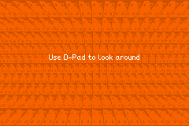
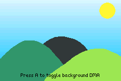
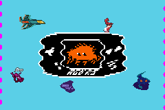
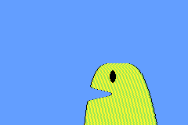
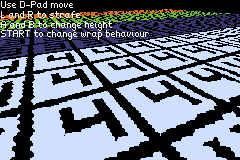
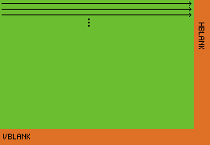
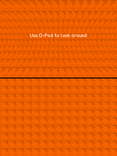

# DMA

DMA stands for 'Direct Memory Access' which doesn't really explain what it does or what it is used for.
It is a built-in component of the Game Boy Advance's hardware which lets you copy memory from one location to another fairly efficiently.

In `agb`, DMA is mainly used for audio (behind the scenes in the mixer), but it can also be used for graphical effects, and we'll refer to graphical effects which use DMA as a core component as 'DMA effects'.

DMA is behind most of the 'mode 7' tricks in the Game Boy Advance, but can also be used for other graphical effects.
Take a look at the [DMA examples](https://agbrs.dev/examples) to see what can be possible with these effects.

<div class="showcase">
<div class="showcase-tile">

DMA used on the background's transformation matrix
</div>
<div class="showcase-tile">

DMA is used to alter the bounding rectangle of a window each frame
</div>
<div class="showcase-tile">

The sky gradient is created using DMA to use only 1 palette colour
</div>
<div class="showcase-tile">

The wobble here is created using DMA on the x-displacement
</div>
<div class="showcase-tile">

The monster is created by altering the x and y displacement and is only 6 distinct tiles.
</div>
<div class="showcase-tile">

This 3d plane is created by altering the background's transformation matrix
</div>
</div>

# How do DMA effects work?



All the effects shown above use the same idea which is taking advantage of the fact that the Game Boy Advance renders the screen one row at a time.

To the right is a diagram which shows how the Game Boy Advances renders to the screen.
There is a brief period of time (known as HBlank) where the screen is not being rendered to.
The DMA effects take advantage of this brief window of time to change some value (like the current x, y scroll position of a background) just before that line is being rendered.

In `agb`, you have access to a _single_ DMA effect each frame.
You can know if something is controllable each line by looking for methods which return a [`DmaControllable`](https://docs.rs/agb/latest/agb/dma/struct.DmaControllable.html).

Note that DMA replaces the value stored in this location with it's own value.
So setting that value during the frame will get overwritten by the DMA effect.

# Using DMA

Once you have a `DmaControllable`, you'll want to actually be able to control it.
You do this by creating an instance of [`HBlankDma`](https://docs.rs/agb/latest/agb/dma/struct.HBlankDma.html) and calling the `.show()` method on it passing the current `frame`.

Because the Game Boy Advance has a vertical resolution of 160 pixels, there are 160 rows to do the DMA replacement with so you need to pass it a slice of at least 160 values which have the same type as the `DmaControllable` that you pass it.

## A note on performance

Although these effects may look like they take a lot of CPU time, the only time actually being spent is creating the array of 160 values.
If you can do as much of that work outside of your main game loop, then these effects are basically free.

# Vertical gradients using a single palette colour


The [`background_palette_colour_dma()`](https://docs.rs/agb/latest/agb/display/tiled/struct.VRamManager.html#method.background_palette_colour_dma) (and it's companion the [`background_palette_colour_256_dma()`](https://docs.rs/agb/latest/agb/display/tiled/struct.VRamManager.html#method.background_palette_colour_256_dma)) methods let you control a single colour in a background palette on each line.
The main use for this is creating gradient patterns or applying effects which would take much more colours than is normally available in the 256 colour palette of the Game Boy Advance.

The `DmaControllable` for this is over a single [`Rgb15`](https://docs.rs/agb/latest/agb/display/struct.Rgb15.html) representing the colour for that line.

```rust
use agb::{
    include_colours,
    display::tiled::VRAM_MANAGER,
    dma::HBlankDma,
};

// The `include_colours!` macro returns an array of every colour used in the
// provided image file, from left to right, top to bottom including repeats.
static SKY_GRADIENT: [Rgb15; 160] =
    include_colours!("examples/gfx/sky-background-gradient.aseprite");

// The colour of the blue used in the background.
const DARKEST_SKY_BLUE: Rgb = Rgb::new(0x00, 0xbd, 0xff);

// Find the index of the colour because it could be anywhere in the palette
// (since the palette was created via `include_background_gfx!`).
let background_colour_index = VRAM_MANAGER
    .find_colour_index_16(0, DARKEST_SKY_BLUE.to_rgb15())
    .expect("Should contain the dark sky blue colour");

HBlankDma::new(
    VRAM_MANAGER.background_palette_colour_dma(0, background_colour_index),
    &SKY_GRADIENT,
)
.show(&mut frame);
```

If you wanted the colours to change per frame (or for example animate the gradient), you could pass some subslice to the `HBlankDma::new()` function (assuming that slice you create has at least 160 elements).

See the [example](https://agbrs.dev/examples/dma_effect_background_colour) for the full code listing.

# `x` and `y` scroll DMAs for regular backgrounds

The simplest effects you can do with the `x` and `y` scroll DMAs are the [magic spell](https://agbrs.dev/examples/dma_effect_background_magic_spell) and the [desert heat wave](https://agbrs.dev/examples/dma_effect_background_desert) examples.
These work by altering the x and y scroll values for each line to create this background effect.

You can control the scroll offset using DMA by using the `x_scroll_dma()` and `y_scroll_dma()` methods on [`RegularBackgroundId`](https://docs.rs/agb/latest/agb/display/tiled/struct.RegularBackgroundId.html).
There is also the combined `scroll_dma()` function which lets you control both at the same time.

A key thing to note here is that the `y` value you set here to is _not_ the `y` value from the background that's used.
Instead, you are controlling the `y`-scroll value, so the current line is added to this value before this line is rendered.
This is different from the affine background transformation which will be covered later.

```rust
use alloc::{boxed::Box, vec::Vec};

use agb::{
    display::HEIGHT,
    dma::HBlankDma,
    fixnum::Num,
};

// Calculate this outside the loop because sin is a little slow
let offsets: Box<[Num<i32, 8>]> = (0..(32 * 8 + HEIGHT))
    .map(|y| (Num::new(y) / 16).sin())
    .collect();

loop {
    let mut frame = gfx.frame();
    let bg_id = background.show(&mut frame);

    // Calculate the y scroll value for the current frame
    let offsets: Vec<_> = (0..160)
        .map(|y| (offsets[y + frame_count] * 3).floor() as u16)
        .collect();

    HBlankDma::new(background_id.y_scroll_dma(), &offsets).show(&mut frame);
    frame.commit();
}
```

# Non-rectangular windows

If you recall from the [windows](./blending_and_windows.md#windows) article, windows must be rectangular or created by an object.
However, the best way to create non-rectangular windows (such as the circular one in the example above) is by using DMA to change the boundaries of the window each row.
You can control the start and end horizontal points of either `Win0` or `Win1` by using the [`horizontal_pos_dma()`](https://docs.rs/agb/latest/agb/display/struct.MovableWindow.html#method.horizontal_pos_dma) method.

This _only_ controls the horizontal position and not the vertical position, so you'll need to ensure you've called `.set_pos()` on the window with the correct height before letting DMA take control of the width.

The [circular window](https://agbrs.dev/examples/dma_effect_circular_window) example shows how to use this trick to create a moving circular window which shows the background through it.

The key section is:

```rust
let mut frame = gfx.frame();
let background_id = map.show(&mut frame);

let window = frame.windows();

window
    .win_in(WinIn::Win0)
    .enable_background(background_id)
    // Here we set the height of the window. The horizontal position will
    // be overwritten by the HBlankDma below, but the vertical position is
    // important.
    .set_pos(Rect::new(pos.floor(), (64, 65).into()));

let dma_controllable = window.win_in(WinIn::Win0).horizontal_pos_dma();
HBlankDma::new(dma_controllable, &circle_poses).show(&mut frame);

frame.commit();
```

# Non-affine transformations

## The pipe effect



Affine transformations on backgrounds have the property that parallel lines remain parallel.
However, this isn't always the desired outcome in a game, especially one which wants to do pseudo-3d effects.

In the example to the right, above the line is how it finally renders and below is the actual background being used.
Although the horizontal lines remain parallel, the vertical lines are not.
This is an indication that DMA is changing the affine transformation each row.

The affine DMA transformations work differently from regular background transformations, mainly around the `y` value of the affine matrix.
Each time the affine matrix is set, it'll reset the current 'y counter'.
So each line is rendered almost as-if `y = 0`, and therefore you'll often see `y` being added back on to compensate for this.

See [the example code](https://agbrs.dev/examples/dma_effect_affine_background_pipe) for the full listing, here are the key parts.

The key idea to notice here is that we want to scale the x-direction differently for each line.
And also that we want the scaling to be relative to the center of the screen.
This part will be the same each frame, so it is worth it to do as much as possible outside the loop for performance reasons.

```rust
let scale_transform_matrices = (0..160)
    .map(|y| {
        // theta here ranges from 0.0 to 0.5 for the various y values
        // so that sin produces a single up-down
        let theta: Num<i32, 8> = Num::new(y) / 160 / 2;
        // scale here is how much to stretch the x-axis
        let scale = (num!(2.1) - theta.sin()) * num!(0.5);

        // This is for the subtle y-scaling. You don't technically
        // need this and can use just `Num::new(y)` but this makes the
        // pipe effect more realistic.
        //
        // An interesting part here is that we are offsetting from `y` directly.
        // This is because the current `y` offset resets each time the transformation
        // matrix is updated by the DMA write. If this were a regular background
        // and you were controlling the current `y` scroll value, you would _not_
        // want to add the current `y` value.
        let y = Num::new(y) - (theta * 2).sin() * 8;

        // Remember that affine matrices work backwards, so this will move to the
        // middle and then increase the size by `scale`.
        AffineMatrix::from_scale(vec2(num!(1) / scale, num!(-1)))
            * AffineMatrix::from_translation(-vec2(num!(WIDTH / 2), y))
    })
    .collect::<Vec<_>>();
```

Now we do less work in the per-frame case:

```rust
let transforms = scale_transform_matrices
    .iter()
    .map(|&line_matrix| {
        AffineMatrixBackground::from(AffineMatrix::from_translation(pos) * line_matrix)
    })
    .collect::<Vec<_>>();
HBlankDma::new(transform_dma, &transforms).show(&mut frame);
```

By multiplying each entry by the current location (represented here by `pos`), we can add the illusion of movement to this example.

## The 3d plane effect

You can see the full example [here](https://agbrs.dev/examples/dma_effect_affine_background_3d_plane).

This effect is by far the most complex example in `agb`, and the explanation of the maths behind it can be found in the [tonc article](https://gbadev.net/tonc/mode7.html).
But the idea is the same as the pipe background.
Create a different transformation matrix to apply to the background for each row to create the 3d plane effect.
