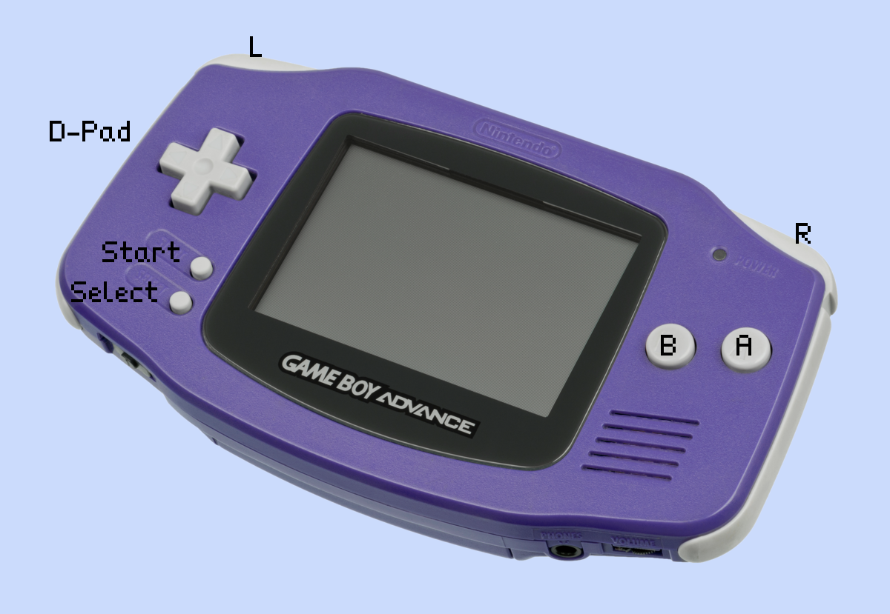

# Input handling



The Game Boy Advance provides a total of 10 buttons.

- The 4 directional pad (D-Pad)
- The A and B buttons
- The L and R triggers
- Start and select buttons

These are represented in `agb` with the [`Button`](https://docs.rs/agb/latest/agb/input/struct.Button.html) struct.

When running the game under an emulator, the default key-mapping on a QWERTY keyboard is as follows:

| GBA button | Emulator   |
| ---------- | ---------- |
| D-pad      | Arrow keys |
| A          | X          |
| B          | Z          |
| Start      | Enter      |
| Select     | Backspace  |
| L trigger  | A          |
| R trigger  | S          |

# Reading the current state

To track the currently pressed buttons, you need a [`ButtonController`](https://docs.rs/agb/latest/agb/input/struct.ButtonController.html).
Create one with the `ButtonController::new()` method, and then each frame use the `update()` method to update its current state.

```rust
use agb::input::ButtonController;

let mut button_controller = ButtonController::new();

loop {
    button_controller.update();
    // Do your game logic using the button_controller

    let mut frame = gfx.frame();
    // ...
    frame.commit();
}
```

In theory you could have multiple `ButtonController` instances across your game, but most will create one and pass it through as needed.

# Useful ButtonController methods

There are a few methods provided on the `ButtonController` which allow you to easily handle user input.

## `.is_pressed()` and `.is_released()`

The simplest methods are the `is_pressed()` and `is_released()` methods.
These takes a `Button` and returns a boolean indicated whether or not the given button is pressed or released.

```rust
if button_controller.is_pressed(Button::B) {
    // do something while the `B` button is pressed
}
```

You can use this method for changing some state while a button is pressed.
For example, increasing the player's speed while they are pressing the `B` button to implement running.

## `.is_just_pressed()` and `.is_just_released()`

These will return true for 1 frame when the provided button transitions from not pressed to pressed.
You can use these as interaction with a menu, or a jump.

You could use `.is_just_released()` to act on a menu action to do the action on release of the button.

```rust
if button_controller.is_just_released(Button::A) {
    // do the action of the currently selected menu item
}
```

## `x_tri()`, `y_tri()` and `lr_tri()`

The [`Tri`](https://docs.rs/agb/latest/doc/agb/input/enum.Tri.html) enum represents a negative, zero or positive value.
Its main use is to represent whether the D-Pad could be considered to be going in some direction or not at all, gracefully handling the case where the player has both buttons pressed at once.

`Tri` can be converted to a signed integer to use it to easily move something player controlled.
For example, we use it in the 'pong' tutorial to move the paddle based on the `y` direction being pressed.

```rust
paddle.move_by(button_controller.y_tri() as i32);
```

These methods also have `just_pressed()` variants which can be used in the same way as the `is_just_pressed()` methods to be able to have a direction which is affected for a single frame.

## `vector()`

The `vector()` method is a combination of the `x_tri()` and `y_tri()` methods.
It returns a vector with an `x` and `y` component of `-1`, `0` or `1` depending on whether that direction is pressed.
This can be used to move a player around in a 2d-plane, or you can use the `just_pressed_vector()` to allow navigation of a 2d menu.

# Detecting simultaneous button presses

All the methods which accept `Button` as an argument can check if multiple buttons are pressed at once.
You can do this with:

```rust
if button_controller.is_pressed(Button::A | Button::B) {
    // ...
}
```

The above if statement will only happen if both A and B are pressed simultaneously.

Using this with `is_just_pressed` isn't recommended because it can be quite hard to press button simultaneously within the 1/60th of a frame time you'd have.
