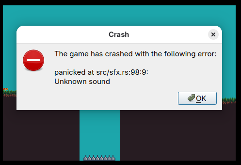

# The panic screen

If a game written using `agb` panics, you'll be greeted with a crash screen.
This screen provides both the panic message along with a special code which you can use to produce a stack trace for the error.


The QR code shown will also link you to the `agb` website where you can view more details about the crash (in the case for the example above, [here](https://agbrs.dev/crash#3K8CDNW010O2W013KgQFq05i05av1)).
If using the mGBA emulator, the link will also be printed to the console.

All the information is calculated from the code (`3K8CDNW010O2W013KgQFq05i05av1` in the above case), and no information about your game is transmitted to the crash page.
It mainly exists to provide you with an easy way to transfer the code to your computer so you can examine the crash more easily.

# Decoding the results

The crash screen will include the file and line number where the panic occurred.
This is often enough to work out where the issue may lie.
However, sometimes it is useful to get the full stack trace.

## The `agb-debug` cli

You can install the `agb-debug` tool with the following command:

```sh
cargo install --git=https://github.com/agbrs/agb.git agb-debug
```

Then with `agb-debug`, you can give it a link to the `elf` file for your ROM and the code and it'll give the full stack trace.
For example:

```text
$ agb-debug target/thumbv4t-none-eabi/release/the_hat_chooses_the_wizard 3K8CDNW010O2W013KgQFq05i05av1
0:	__rustc::rust_begin_unwind <agb>/lib.rs:407
		let frames = backtrace::unwind_exception();
		             ^
1:	core::panicking::panic_fmt <core>/panicking.rs:75
2:	the_hat_chooses_the_wizard::sfx::SfxPlayer::snail_death <the-hat-chooses-the-wizard>/sfx.rs:94
		panic!("Unknown sound");
		^
3:	the_hat_chooses_the_wizard::enemies::Snail::update <the-hat-chooses-the-wizard>/enemies.rs:350
		sfx_player.snail_death();
		^
	(inlined into) the_hat_chooses_the_wizard::enemies::Enemy::update <the-hat-chooses-the-wizard>/enemies.rs:51
		Enemy::Snail(snail) => snail.update(level, player_pos, hat_state, timer, sfx_player),
		                       ^
4:	the_hat_chooses_the_wizard::PlayingLevel::update_frame <the-hat-chooses-the-wizard>/lib.rs:681
		match enemy.update(
		      ^
	(inlined into) the_hat_chooses_the_wizard::main <the-hat-chooses-the-wizard>/lib.rs:813
		match level.update_frame(&mut sfx) {
		      ^
5:	the_hat_chooses_the_wizard::_agb_main_func_2381583852303396514::inner <the-hat-chooses-the-wizard>/main.rs:9
		the_hat_chooses_the_wizard::main(gba);
		^
6:	main <the-hat-chooses-the-wizard>/main.rs:7
		#[agb::entry]
		^
```

The `agb-debug` cli will include the actual code snippets from your filesystem if it can find it.

## `agbrs.dev/crash`

You can also use the crash page itself, giving it your elf file.
All this is done within your browser, and nothing gets passed to the `agb` servers.


# Debugging `.gba` files

When creating a `.gba` file using `agb-gbafix`, it will, by default, strip out the debug information which is required to provide the backtrace information as shown.
You are able to run the `.gba` file and pass `agb-gbafix` the elf file which was converted into the `gba` file if needed.
However, you can also include all the debug information in the `gba` file itself by passing the `-g` argument to `agb-gbafix`.

```sh
$ agb-gbafix -g target/thumbv4t-none-eabi/release/my_game target/my_game.gba
```

Both the backtrace viewer on the [agbrs.dev/crash](https://agbrs.dev/crash) website and the `agb-debug` cli tool will be able to parse the debug information out of the gba file.
Note that this will quite drastically increase the size of your `.gba` file and it could end up getting close to the cartridge size limits.

# Configuring the target website

The target website can be configured by setting the `AGBRS_BACKTRACE_WEBSITE` environment during the build.

```sh
# Direct players to your website
AGBRS_BACKTRACE_WEBSITE="https://example.com/test#" cargo build

# Don't have a website at all. The QR code will just be the ID
AGBRS_BACKTRACE_WEBSITE="" cargo build
```

To completely disable the backtraces, you can disable the `backtrace` feature in `agb` by editing your `Cargo.toml` as follows:

```toml
# Disable the `backtrace` feature
agb = { version = "...", default-features = false, features = ["testing"] }
```

<div class="showcase">
    <div class="showcase-tile">
        
        Custom website configured
    </div>
    <div class="showcase-tile">
        
        No website configured
    </div>
    <div class="showcase-tile">
        
        Backtraces disabled, the game just freezes
    </div>
</div>
