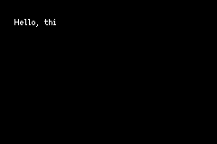

# Text rendering

There are many techniques for displaying text using `agb` with varying levels of support.
Perhaps the simplest is to produce sprites or background tiles that contain text that you show using the usual means.
This technique can get you very far!
For instance: text in title screens, options in menus, and any text in the HUD could (and as we will discuss, should) all be pre-rendered.
For detail on how to do these, see the [backgrounds](./backgrounds.md) or [objects](./objects_deep_dive.md) articles.

What we will discuss here is _dynamic_ rendering of text. Where the text can be decided at runtime.

# `agb` text rendering principles

The text rendering system in `agb` has support for:

- Unicode
- Variable size letters
- Kerning
- Left, right, centre, and justified alignments
- Left to right text only



However, text rendering on the GBA is slow.
Even just laying the text out, deciding where to put each character, is slow.
For this reason, the API for text rendering is designed to spread work over multiple frames as much as possible.
This naturally results in the effect of only adding a couple characters each frame that is so common in games even today.
If you instead want to display text instantly, consider pre-rendering it.

The text rendering system is split into the layout and the backend renderers.
The `Layout` is an iterator of `LetterGroup` which stores a group of characters and where they should be displayed providing a `pixels` iterator which gives an iterator over all the pixels to render.
This includes any detail around kerning, alignment, etc.

With these letter groups, you can pass them to the Object or Tile based renderers.
The tile based renderer takes a reference to a regular background and displays the letters given by the group on it.
The object based render takes the letter group and gives back an object that represents that letter group.

# Font

Importing a font is done using the [`include_font`](https://docs.rs/agb/latest/agb/macro.include_font.html) macro.
This takes a path to a ttf and the font size to use to import. For example:

```rust
static FONT: Font = include_font!("fnt/ark-pixel-10px-proportional-latin.ttf", 10);
```

If you have created your own pixel font, you can convert it to ttf using [YAL's Pixel Font Converter!](https://yal.cc/tools/pixel-font/)
This tool lets you define a font from an image including variable sized letters and kerning pairs.
It also lets you export the settings which we encourage you to keep in version control.

You can find pixel fonts with many under permissive licenses on the [https://www.pentacom.jp/pentacom/bitfontmaker2/gallery/](bitfontmaker2)'s website.

# Layout

The [`Layout`](https://docs.rs/agb/latest/agb/display/font/struct.Layout.html) is an `Iterator` over [`LetterGroup`](https://docs.rs/agb/latest/agb/display/font/struct.LetterGroup.html)s.
A `LetterGroup` is a set of letters to be drawn at once.
The `Layout` handles correctly positioning the letter groups including performing line breaks where required and correctly aligning the text.
It does this incrementally, doing as little work as possible to generate the next groups position.

```rust
let text_layout = Layout::new(
    "Hello, this is some text that I want to display!",
    &FONT,
    AlignmentKind::Left,
    32,
    200,
);
```

# Colour changes

To have multiple colours in your text, you can use [`ChangeColour`](https://docs.rs/agb/latest/agb/display/font/struct.ChangeColour.html).

```rust
const COLOUR_1: ChangeColour = ChangeColour::new(1);
const COLOUR_2: ChangeColour = ChangeColour::new(2);

let text = format!("Hey, {COLOUR_2}you{COLOUR_1}!",);
```

You might want to use static text rather than using Rust's text formatting, in that case see the documentation for [`ChangeColour`](https://docs.rs/agb/latest/agb/display/font/struct.ChangeColour.html) where it documents the exact code points you need to use.

## Tags

You might want to treat certain parts of your text differently to other parts.
Maybe some text should wiggle around, maybe some text should be delayed in the time taken to display it.
You can encode this user state using the tag system.

The tag system gives 16 user controllable bits that you can set and unset during processing of text.
Here's a simple example that shows how this works with `LetterGroup`s.

```rust
const MY_TAG: Tag = Tag::new(0);
// set the tag with `set` and unset with `unset`.
let text = alloc::format!("#{}!{}?", MY_TAG.set(), MY_TAG.unset());
let mut layout = Layout::new(&text, &FONT, AlignmentKind::Left, 32, 100);

// get whether the tag is set with `has_tag` on `LetterGroup`.
assert!(!layout.next().unwrap().has_tag(MY_TAG));
assert!(layout.next().unwrap().has_tag(MY_TAG));
assert!(!layout.next().unwrap().has_tag(MY_TAG));
```

which can be extended within your text display system.
A complete example of this can be seen in the [advanced object text rendering example](https://agbrs.dev/examples/object_text_render_advanced).
If you want to use Tags without using Rust's text formatting, the documentation for [`Tag`](<(https://docs.rs/agb/latest/agb/display/font/struct.Tag.html)>) documents the exact code points you need to use.

# Renderers

The groups that come from the `Layout` can be used in the render backends.
There is a backend for displaying text using `Object`s and another for using background tiles.

## ObjectTextRenderer

The `ObjectTextRenderer` takes in a `LetterGroup` and gives back an `Object` that represents that group.
To create one, you need to provide a palette and the size of sprites to use.
It is important that the size of sprite is greater than or equal to the maximum group size that is specified in the `Layout`.

A simple example of the `ObjectTextRender` would look like

```rust
let text_layout = Layout::new(
    "Hello, this is some text that I want to display!",
    &FONT,
    AlignmentKind::Left,
    16, // minimum group size is 16, so the sprite size I use should be at least 16 wide
    200,
);

// using an appropriate sprite size, palette should come from somewhere
let text_render = ObjectTextRenderer::new(PALETTE.into(), Size::S16x16);
let objects: Vec<_> = text_layout.map(|x| text_render.show(&x, vec2(16, 16))).collect();

// then show the objects in the usual way
```

The full example can be found in the [`object_text_render_simple`](https://agbrs.dev/examples/object_text_render_simple) example.

Normally you would divide this work over multiple frames.
This is to minimise the work for layout and rendering which could otherwise cause frames to be skipped or audio to be skipped.

```rust
// use the standard graphics system
let mut gfx = gba.graphics.get();

// this is now mutable as we will be calling `next` on it
let mut text_layout = Layout::new(
    "Hello, this is some text that I want to display!",
    &FONT,
    AlignmentKind::Left,
    16,
    200,
);

let text_render = ObjectTextRenderer::new(PALETTE.into(), Size::S16x16);
let mut objects = Vec::new();

loop {
    // each frame try to grab a letter group and add it to the objects list
    if let Some(letter) = text_layout.next() {
        objects.push(text_render.show(&letter, vec2(16, 16)));
    }

    let mut frame = gfx.frame();

    // render everything in the objects list
    for object in objects.iter() {
        object.show(&mut frame);
    }

    frame.commit();
}
```

The full example for this pattern can be found in [`object_text_render_intermediate`](https://agbrs.dev/examples/object_text_render_intermediate).

One of the main reasons to use objects for your text is to be able to individually manipulate your objects to create special effects.
The [`object_text_render_advanced`](https://agbrs.dev/examples/object_text_render_advanced) example showcases this use case.

## RegularBackgroundTextRenderer

You can also put text on a background.
This you provide with a `RegularBackground` and a `LetterGroup` and it will display that `LetterGroup` on that `RegularBackground`.

```rust
let mut bg = RegularBackground::new(
    Priority::P0,
    RegularBackgroundSize::Background32x32,
    TileFormat::FourBpp,
);

let text_layout = Layout::new(
    "Hello, this is some text that I want to display!",
    &FONT,
    AlignmentKind::Left,
    32,
    200,
);

// this takes the position of the text
let mut text_renderer = RegularBackgroundTextRenderer::new((4, 0));

for letter in text_layout {
    text_renderer.show(&mut bg, &letter);
}
```

Normally you will want to split this over multiple frames to prevent skipped frames or audio skipping.

```rust
let mut bg = RegularBackground::new(
    Priority::P0,
    RegularBackgroundSize::Background32x32,
    TileFormat::FourBpp,
);

let text_layout = Layout::new(
    "Hello, this is some text that I want to display!",
    &FONT,
    AlignmentKind::Left,
    32,
    200,
);

let mut text_renderer = RegularBackgroundTextRenderer::new((4, 0));

loop {
    if let Some(letter) = text_layout.next() {
        text_renderer.show(&mut bg, &letter);
    }

    let mut frame = gfx.frame();

    bg.show(&mut frame)

    frame.commit();
}
```

This can be found in the [`background_text_render`](https://agbrs.dev/examples/background_text_render) example.

## Custom

`LetterGroup`s provide a `pixels` method which is an iterator over all the pixels that need to be set to draw those characters.
Using this you can have your own backends to render text however you want.
For example, you could use this to create your own effect similar to the [no game](https://agbrs.dev/examples/no_game) example but with dynamic text.
