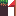

# Getting started

In this chapter, we'll set up a new project for our platformer and download the assets we need.

# Creating the project

Start by cloning a fresh copy of the [agb template](https://github.com/agbrs/template):

```sh
git clone https://github.com/agbrs/template.git platform
cd platform
```

If you haven't set up your development environment yet, follow the [environment setup](../setup/setup.md) instructions first.

# Setting up `Cargo.toml`

Our build script will need a few extra dependencies to parse Tiled levels at compile time.
Run the following commands to add them:

```sh
cargo add --build quote proc-macro2 tiled
```

# Downloading the assets

We need two graphics files for this game: a tileset for the level backgrounds and a sprite sheet for the player character.

Download these files and place them in a `gfx/` directory in your project:

- [tileset.png](./tileset.png) — save as `gfx/tileset.png`
- [sprites.aseprite](./sprites.aseprite) — save as `gfx/sprites.aseprite`



# Project structure

Once you've done the above, your project should look like this:

```
platform/
├── Cargo.toml
├── gfx/
│   ├── tileset.png
│   └── sprites.aseprite
└── src/
    └── main.rs
```

Don't worry about the `build.rs` or `tiled/` directory yet — we'll create those in the next chapters.
If the template already contains a `build.rs`, that's fine — we'll replace its contents later.

# Verify it builds

Before moving on, make sure the template still builds:

```sh
cargo build --release
```

You should see a successful build. The game won't do anything interesting yet, but this confirms your toolchain is working.
