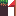
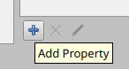
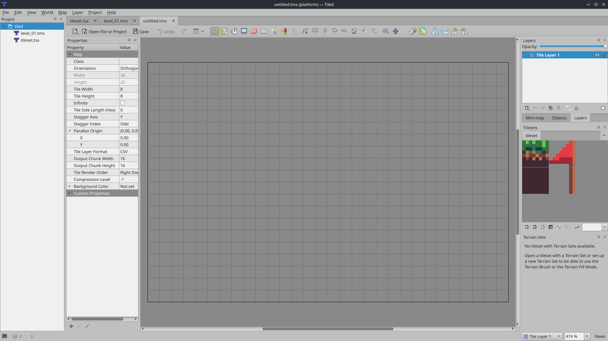
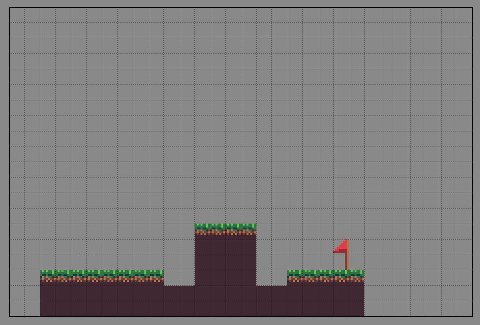
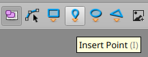
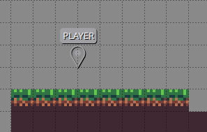

# Tiled

[Tiled](https://www.mapeditor.org/) is an open source level editor.
Many `agb` games have been made using tiled as their level editors.
For example: [The Hat Chooses the Wizard](https://agbrs.dev/showcase/the-hat-chooses-the-wizard), [The Purple Night](https://agbrs.dev/showcase/the-purple-night), [The Dungeon Puzzler's Lament](https://agbrs.dev/showcase/the-dungeon-puzzlers-lament), and [Khiera's Quest](https://agbrs.dev/showcase/khieras-quest) all used Tiled.

This will serve a very quick introduction to using tiled to make levels.
Tiled can do a lot, so I would encourage you to play around with it yourself, but bear in mind we are writing the level loading system.
This means that some things that look like features are actually up to us to implement.

You should obtain Tiled using whatever means best supported by your operating system.
The [documentation for Tiled can be found here](https://doc.mapeditor.org/en/stable/).

# Getting setup to make a level

Open up Tiled and create a new project, _File -> New -> New Project..._ or using the button that should be on the main page.
Save this project in the directory for your game.

Create a tileset, this can be done through the button that should be on your screen or using _File -> New -> New Tileset..._.
For our game, I have prepared this simple tilesheet that includes a grassy tile, a wall tile, and a flag that will be for the end of the level.

Give the tileset a relevant name (`tileset`, for instance) and make sure to set the width and height of the tile to be 8px by 8px.
In the tileset interface, we can attach custom properties to the tiles.
Our game has tiles that are colliding and tiles that if touched cause the level to be beaten.
We can attach these tags to the tileset using tiled.
Select all the tiles and using the _Add property_ button add `WIN` and `COLLISION` boolean properties.

Check the collision property on the grass and wall tile, and check the win property on the flag and flagpole.
When we come to writing our level importer, we will need to manually deal with these properties.

Now we want to create a Map, _File -> New -> New Map..._.
Make sure that the tile width and height are both 8px and that the map size is fixed with a width and height of 30x20 tiles.

# Quickly putting a level together

On the right you see your layers and tilesets.
Rename the layer to be something more useful, for instance `Level`.
Using your tileset, draw a level out.
Make it very basic because level design is intrinsically linked to the mechanics of your platforming game which we've not made yet.
Here's what I quickly drew.

We want to encode as much about the level as possible in tiled.
One thing we might think of including is the start position of the player.
We can do this using an object layer.
_Layer -> New -> Object Layer_ and again give it a name like `Objects`.

With your object layer selected, in the top bar you should see an `Insert Point` icon.
Use this to add a point to your level and call the point `PLAYER`.

# Summary

We've seen how we can use tiled to put a level together.
I would encourage you to take the opportunity to explore around tiled and get a feel for the tool.
In the next chapter we will be writing the importer to make our level accessible to the GBA.
