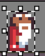

# Platforming physics

Designing the physics system for a platformer can be as complicated as you want it to be.
Modern platformers use a vast set of tricks to make it feel responsive and fair.
We're going to ignore it all to make something simple.

This will be the character we use, the wizard from the Hat Chooses the Wizard.
The file contains a few Tags that define various animations that we will be using.
[Here is the aseprite file](./sprites.aseprite).


Firstly we'll add our main collision check function on the level which takes a coordinate and returns true when a colliding tile is on that coordinate.

```rust
impl Level {
    fn collides(&self, tile: Vector2D<i32>) -> bool {
        if !self.bounds().contains_point(tile) {
            return false;
        }

        let idx = (tile.x + tile.y * self.width as i32) as usize;

        self.collision_map[idx / 8] & (1 << (idx % 8)) != 0
    }
}
```

Now for creating the player.
This will handle the input from the player and update itself.
Here is a potential player you could use that handles some controls but no collision or gravity.

```rust
// define a common set of number and vector type to use throughout
type Number = Num<i32, 8>;
type Vector = Vector2D<Number>;

struct Player {
    position: Vector,
    velocity: Vector,
    frame: usize,
    flipped: bool,
}

impl Player {
    fn new(start: Vector2D<i32>) -> Self {
        Player {
            position: start.change_base(),
            velocity: (0, 0).into(),
            frame: 0,
            sprite: sprites::STANDING.sprite(0).into(),
            flipped: false,
        }
    }

    // Checks whether the bottom of our sprite + 1 of the smallest
    // subpixel values is colliding with something. If it is, then
    // we're on the ground
    fn is_on_ground(&self, level: &Level) -> bool {
        let position_to_check = vec2(
            self.position.x,
            self.position.y + 8 + Number::from_raw(1),
        );
        level.collides(position_to_check.floor() / 8)
    }

    // modifies the velocity accounting for various bonuses
    fn handle_horizontal_input(&mut self, x_tri: i32, on_ground: bool) {
        let mut x = x_tri;

        // If we're trying to move in a direction opposite to what
        // we're currently moving, we should decelerate faster.
        // This is a classic trick that is used to make movement
        // feel more snappy, it was used in the first super mario game!
        if x_tri.signum() != self.velocity.x.to_raw().signum() {
            x *= 2;
        }

        if on_ground {
            x *= 2;
        }

        self.velocity.x += Number::new(x) / 16;
    }

    // Make a simple modification to the y velocity for jumping. 
    // Many games reduce the gravity while the button is held
    // to make varying jump heights.
    fn handle_jump(&mut self) {
        self.velocity.y = Number::new(-2);
    }

    // Handle various cases of the movement to display a different animation
    fn update_sprite(&mut self) {
        self.frame += 1;

        // We need to keep track of the facing direction rather than deriving
        // it because of the zero 0 velocity case needs to keep facing the
        // same direction. 
        if self.velocity.x > num!(0.1) {
            self.flipped = false;
        }
        if self.velocity.x < num!(-0.1) {
            self.flipped = true;
        }

        self.sprite = if self.velocity.y < num!(-0.1) {
            sprites::JUMPING.animation_frame(&mut self.frame, 2)
        } else if self.velocity.y > num!(0.1) {
            sprites::FALLING.animation_frame(&mut self.frame, 2)
        } else if self.velocity.x.abs() > num!(0.05) {
            sprites::WALKING.animation_frame(&mut self.frame, 2)
        } else {
            sprites::STANDING.animation_frame(&mut self.frame, 2)
        }
        .into()
    }


    // the main update function that defers to all the other updaters
    fn update(&mut self, input: &ButtonController, level: &Level) {
        let on_ground = self.is_on_ground(level);

        self.handle_horizontal_input(input.x_tri() as i32, on_ground);

        if input.is_just_pressed(Button::A) && on_ground {
            self.handle_jump();
        }

        // friction, you could make air friction different to ground friction
        self.velocity.x *= 15;
        self.velocity.x /= 16;

        self.update_sprite();
    }

    // displays the sprite to the screen
    fn show(&self, frame: &mut GraphicsFrame) {
        Object::new(self.sprite.clone())
            .set_hflip(self.flipped)
            .set_pos(self.position.round() - vec2(8, 8))
            .show(frame);
    }
}
```

In your main function you can add the player.
You should create the player before the loop, call update in the loop and show in the frame.
For instance, that could look like this

```rust
#[agb::entry]
fn main(mut gba: agb::Gba) -> ! {
    let mut gfx = gba.graphics.get();

    VRAM_MANAGER.set_background_palettes(tiles::PALETTES);

    let level = levels::LEVELS[0];
    let mut bg = World::new(level);
    let mut input = ButtonController::new();

    let mut player = Player::new(level.player_start.into());

    loop {
        input.update();
        bg.set_pos(vec2(0, 0));
        player.update(&input, level);

        let mut frame = gfx.frame();

        bg.show(&mut frame);
        player.show(&mut frame);

        frame.commit();
    }
}
```

# Collision

Collision detection is somewhat simple, I've already shown how we can detect collisions.
Collision response is the hard part and contributes significantly to game feel.
You can have stiff controls that are unforgiving, or incredibly generous controls and both games can be excellent.
In your games, do experiment with your collision response system.

With that said, I will be using a fairly forgiving system and presenting it without too much justification.

```rust
impl Player {
    // Handles the collision for a single component (x or y) of the
    // position / velocity. If a collision is detected on the external
    // point of the sprite in the relevant axis, then the position is
    // corrected to be outside of the tile and velocity set to zero.
    fn handle_collision_component(
        velocity: &mut Number,
        position: &mut Number,
        half_width: i32,
        colliding: &dyn Fn(i32) -> bool,
    ) {
        let potential = *position + *velocity;
        let potential_external = potential + velocity.to_raw().signum() * half_width;

        let target_tile = potential_external.floor() / 8;

        if !colliding(target_tile) {
            *position = potential;
        } else {
            let center_of_target_tile = target_tile * 8 + 4;
            let player_position =
                center_of_target_tile - velocity.to_raw().signum() * (4 + half_width);
            *position = player_position.into();
            *velocity = 0.into();
        }
    }

    // calls out to the component handler with the correct parameters.
    fn handle_collision(&mut self, level: &Level) {
        Self::handle_collision_component(&mut self.velocity.x, &mut self.position.x, 4, &|x| {
            level.collides(vec2(x, self.position.y.floor() / 8))
        });
        Self::handle_collision_component(&mut self.velocity.y, &mut self.position.y, 8, &|y| {
            level.collides(vec2(self.position.x.floor() / 8, y))
        });
    }
}
```

Then include it in the `Player`s update function.

```rust
impl Player {
    fn update(&mut self, input: &ButtonController, level: &Level) {
        let on_ground = self.is_on_ground(level);

        self.handle_horizontal_input(input.x_tri() as i32, on_ground);

        if input.is_just_pressed(Button::A) && on_ground {
            self.handle_jump();
        }

        // new! gravity
        self.velocity.y += num!(0.05);
        self.velocity.x *= 15;
        self.velocity.x /= 16;
        // new! collisions
        self.handle_collision(level);

        self.update_sprite();
    }
}
```

# Summary

We've made the base of a simple platformer game.
Not many games come with a single level, and we've already done some work in making our systems support multiple levels.
Therefore, in the next chapter we will see how we can make the level completable and add more levels to the game.
