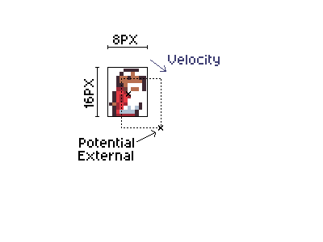

# Collision

In the previous chapter we added a temporary floor clamp to stop the player falling off the screen.
Now let's replace that with real collision detection.

First, remove the `start_y` field from `Player` and the floor clamping logic in `update` — we won't need them any more.

# Collision detection

First, we need a way to check whether a given tile position is solid.
Add this method to the `Level` struct:

```rust
impl Level {
    fn collides(&self, tile: Vector2D<i32>) -> bool {
        if !self.bounds().contains_point(tile) {
            return false;
        }

        let idx = (tile.x + tile.y * self.width as i32) as usize;

        self.collision_map[idx / 8] & (1 << (idx % 8)) != 0
    }
}
```

This is the reverse of what we did in the build script.
We find which byte the tile is in (`idx / 8`) and which bit within that byte (`idx % 8`).
If that bit is set, the tile is solid.

# Ground detection

We need to know when the player is standing on something so they can jump.
Add `is_on_ground` to the `Player`:

```rust
impl Player {
    fn is_on_ground(&self, level: &Level) -> bool {
        let position_to_check = vec2(
            self.position.x,
            self.position.y + 8 + Number::from_raw(1),
        );
        level.collides(position_to_check.floor() / 8)
    }
}
```

We check one sub-pixel below the bottom of the sprite.
If there's a collision there, we're standing on something.
The `+ 8` accounts for the half-height of the sprite (since `position` is the center), and `Number::from_raw(1)` adds the smallest possible sub-pixel offset.

# How collision response works

Collision detection (asking "is there a solid tile here?") is straightforward.
Collision _response_ (deciding what to do about it) is the hard part, and contributes significantly to how your game feels.



Our approach handles each axis (X and Y) independently.
For each axis, we:

1. Calculate where the player would be after applying velocity (`potential`).
2. Find the leading edge of the sprite in the direction of movement (`potential_external`). For horizontal movement, this is 4 pixels from center (the sprite's half-width). For vertical movement, this is 8 pixels from center (the sprite's half-height).
3. Convert that edge position to tile coordinates.
4. If the tile is **not** solid: move to the potential position.
5. If the tile **is** solid: snap the player so their edge is flush with the tile boundary, and zero the velocity.

By handling each axis independently, we avoid corner cases where diagonal movement could clip through walls.

# The collision handler

```rust
impl Player {
    fn handle_collision_component(
        velocity: &mut Number,
        position: &mut Number,
        half_width: i32,
        colliding: &dyn Fn(i32) -> bool,
    ) {
        let potential = *position + *velocity;
        let potential_external = potential + velocity.to_raw().signum() * half_width;

        let target_tile = potential_external.floor() / 8;

        if !colliding(target_tile) {
            *position = potential;
        } else {
            let center_of_target_tile = target_tile * 8 + 4;
            let player_position =
                center_of_target_tile - velocity.to_raw().signum() * (4 + half_width);
            *position = player_position.into();
            *velocity = 0.into();
        }
    }

    fn handle_collision(&mut self, level: &Level) {
        Self::handle_collision_component(&mut self.velocity.x, &mut self.position.x, 4, &|x| {
            level.collides(vec2(x, self.position.y.floor() / 8))
        });
        Self::handle_collision_component(&mut self.velocity.y, &mut self.position.y, 8, &|y| {
            level.collides(vec2(self.position.x.floor() / 8, y))
        });
    }
}
```

Let's walk through `handle_collision_component` step by step:

- `potential`: where the player's center would be after applying velocity.
- `potential_external`: the leading edge of the sprite in the direction of movement. We use `velocity.to_raw().signum()` to get the direction (+1 or -1) and multiply by the half-width to find the edge.
- `target_tile`: the tile coordinate that the leading edge would enter.
- If no collision: we simply move to the potential position.
- If collision: we find the center of the colliding tile, then position the player so their edge is just outside it. The `4 + half_width` accounts for half of the tile (4 pixels) plus half of the sprite, ensuring the edges are flush. We also zero the velocity to stop movement in that direction.

The `handle_collision` method calls the component handler twice: once for X (using a half-width of 4 pixels) and once for Y (using a half-height of 8 pixels).
Each closure checks for collisions using the current position on the other axis.

# Updating the `update` function

Now replace the `update` method on `Player` with the full version that includes gravity and collision:

```rust
impl Player {
    fn update(&mut self, input: &ButtonController, level: &Level) {
        let on_ground = self.is_on_ground(level);

        self.handle_horizontal_input(input.x_tri() as i32, on_ground);

        if input.is_just_pressed(Button::A) && on_ground {
            self.handle_jump();
        }

        self.velocity.y += num!(0.05);
        self.velocity.x *= 15;
        self.velocity.x /= 16;
        self.handle_collision(level);

        self.update_sprite();
    }
}
```

The key changes from the previous chapter:

- `on_ground` now uses the real `is_on_ground` check instead of the temporary floor clamp.
- Instead of `self.position += self.velocity`, we call `self.handle_collision(level)` which applies velocity while checking for collisions.
- The `start_y` field and floor clamping are gone — collision handles everything now.

Update the main function to pass the level to `update`:

```rust
#[agb::entry]
fn main(mut gba: agb::Gba) -> ! {
    let mut gfx = gba.graphics.get();

    VRAM_MANAGER.set_background_palettes(tiles::PALETTES);

    let level = levels::LEVELS[0];
    let mut bg = World::new(level);
    let mut input = ButtonController::new();

    let mut player = Player::new(level.player_start.into());

    loop {
        input.update();
        bg.set_pos(vec2(0, 0));
        player.update(&input, level);

        let mut frame = gfx.frame();

        bg.show(&mut frame);
        player.show(&mut frame);

        frame.commit();
    }
}
```

Run the game now — the wizard should stand on platforms, run left and right, and jump with the A button!

# What we did

We've added tile-based collision detection and response.
The player can now stand on platforms, walk along them, and jump.
Not many games come with a single level though — in the next chapter we'll add win detection and multiple levels.
