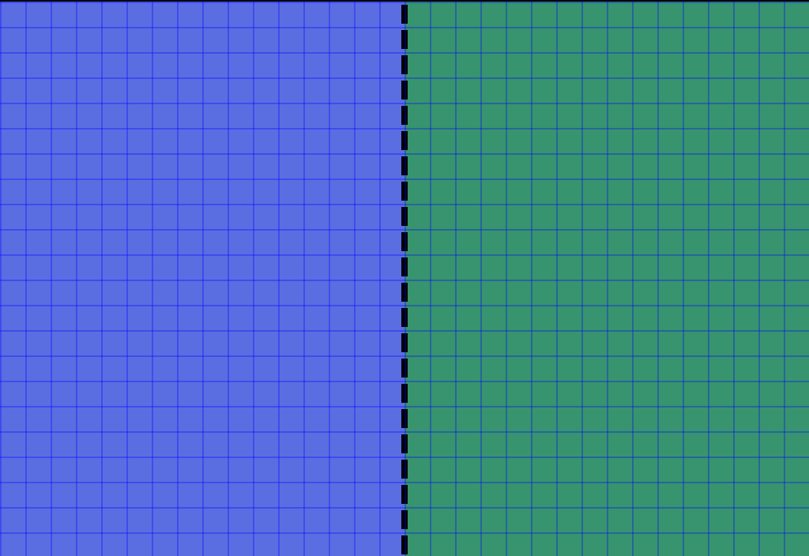

# Backgrounds

In addition to sprites, the GBA can also display up to 4 different background layers.
These can be used for various things, but the main use case for backgrounds are backdrops for the game (hence the name background) and UI elements.

These backgrounds can be stacked on top of each other to create parallax effects, or to add a Heads Up Display (HUD) above the backdrop.

In this pong example, we're going to show a static background behind the play screen to make everything look a little more exciting.

# What are backgrounds?

A background on the GBA is a layer made up of 8x8 tiles.
Like Objects, there are 2 kinds of backgrounds: regular and affine.
We'll stick to regular backgrounds in this tutorial.

Regular backgrounds can display tiles in one of 2 modes.
16-colour mode and 256-colour mode.
In 16-colour mode, each tile is assigned a single 16-colour palette from one of 16 possible palettes.
In 256-colour mode, each tile can use any one of the 256 colours in the palette.

16-colour mode uses half the video RAM and half the space on the cartridge, so most games will use 16-colour tiles where possible (and we will do the same in this tutorial).
This is because it uses 4 bits per pixel of tile data vs. the 8 bits per pixel in 256 colour mode.

Organising the palettes so that you can display your background in one go is handled by `agb`, and is not something you need to worry about.



Above is a background with the tile lines marked out. This will be the background we put on the pong game.
In this case, we will be using the background as the backdrop for our game.
But they can also be used for other purposes like heads up displays (HUDs) to be drawn in front of the player sprite, or to render text onto.

Backgrounds can be scrolled around if needed to allow for easy scrolling levels.
We won't need that in our pong game though.

# Importing backgrounds

Firstly we'll need the aseprite file for the background, which you can get from [here](background.aseprite).
Put this in `gfx/background.aseprite`.

Backgrounds are imported using the [`include_background_gfx!`](https://docs.rs/agb/latest/agb/macro.include_background_gfx.html) macro.

```rust
use agb::include_background_gfx;

include_background_gfx!(
    mod background,
    PLAY_FIELD => deduplicate "gfx/play_field.aseprite",
);
```

The first argument is the name of the module you want created to hold the background data.
The second maps names of static variables within that module to files you want it to import.

`agb` will automatically create palettes which cover every colour used by tiles, and the `deduplicate` option will merge duplicate tiles.
The playing field has a lot of duplicate tiles, so adding the deduplicate option in this case reduces our tile count from 600 to 4.

# Displaying backgrounds

To show the background on the screen, you'll need to do 3 things:

## 1. Register the palettes

The palettes will need registering which you do with a call to [`VRAM_MANAGER.set_background_palettes()`](https://docs.rs/agb/latest/agb/display/tiled/struct.VRamManager.html#method.set_background_palettes).

```rust
use agb::display::tiled::VRAM_MANAGER;

// near the top of main()
VRAM_MANAGER.set_background_palettes(background::PALETTES);
```

## 2. Creating the background tiles

Create a [`RegularBackground`](https://docs.rs/agb/latest/agb/display/tiled/struct.RegularBackground.html) to store the actual tiles.

```rust
use agb::display::{
    Priority,
    tiled::{RegularBackground, RegularBackgroundSize, TileFormat},
};

let mut bg = RegularBackground::new(
    Priority::P3,
    RegularBackgroundSize::Background32x32,
    TileFormat::FourBpp
);

bg.fill_with(&background::PLAY_FIELD);
```

Since we've imported our tiles in 16-colour mode (or 4 bits per pixel), we state [`TileFormat::FourBpp`](https://docs.rs/agb/latest/agb/display/tiled/enum.TileFormat.html#variant.FourBpp) as the colour format.
For priority, we've opted for [`Priority::P3`](https:://docs.rs/agb/latest/agb/display/enum.Priority.html)
This will mean that it is rendered below every background, and below any objects.

## 3. Showing the tiles

Just before the call to `frame.commit()`, call [`bg.show()`](https://docs.rs/agb/latest/agb/display/tiled/struct.RegularBackground.html#method.show).

```rust
bg.show(&mut frame);
frame.commit();
```

# What we did

You should now have a background to the pong game which makes it look way better.
Next we'll look at fixnums and how they can make the game feel a little less flat.

# Exercise

Take a look at the 256 colour mode for importing backgrounds and displaying them.
Change the background to use those instead.
Hint: look at the options in [`include_background_gfx!`](https://docs.rs/agb/latest/agb/macro.include_background_gfx.html), and consider the `TileFormat`.

What are the advantages and disadvantages of using 256 colour mode? Why would you pick it over 16 colour mode?
